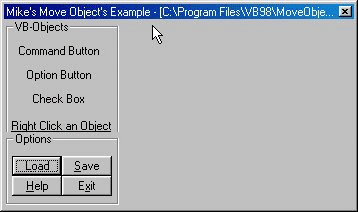



## Mike's Move Objects \- Must See\!

### Description

This is a must see. This project lets you Add objects to a form and lets the User move the object anywhere on it, I also made it so that the object couldn't be moved off of the form. You can also Rename or Delete the object by Right Clicking them. The best thing about this is that you and Load and Save the Objects to/from a .dat file, It saves each open Object's: Top position, Left position, Caption, and Visibility and then is able to load that info. This is a perfect example For you programmers who want to make a program that lets The user move objects around on the Form. See the Screen Shot..  Here's an example on how this is useful..  Visual HTML making programs... Like FrontPage or

Macromedia DreamWeaver... They let the user add objects

and lets them move it around. (Input Button, Option Button..Checkbutton...etc
 
### More Info
 

             |
---                |---
**Submitted On**   |2000-04-23 06:47:48
**By**             |[Michael L\. Canejo](https://github.com/Planet-Source-Code/PSCIndex/blob/master/ByAuthor/michael-l-canejo.md)
**Level**          |Intermediate
**User Rating**    |5.0 (55 globes from 11 users)
**Compatibility**  |VB 4\.0 \(32\-bit\), VB 5\.0, VB 6\.0
**Category**       |[Miscellaneous](https://github.com/Planet-Source-Code/PSCIndex/blob/master/ByCategory/miscellaneous__1-1.md)
**World**          |[Visual Basic](https://github.com/Planet-Source-Code/PSCIndex/blob/master/ByWorld/visual-basic.md)
**Archive File**   |[CODE\_UPLOAD51104232000\.zip](https://github.com/Planet-Source-Code/michael-l-canejo-mike-s-move-objects-must-see__1-7514/archive/master.zip)

